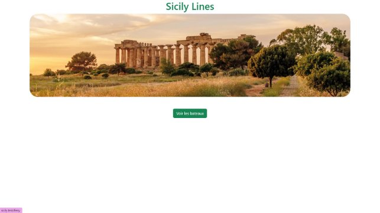
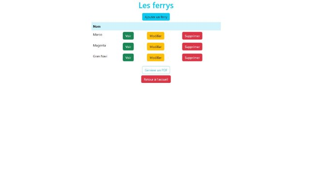
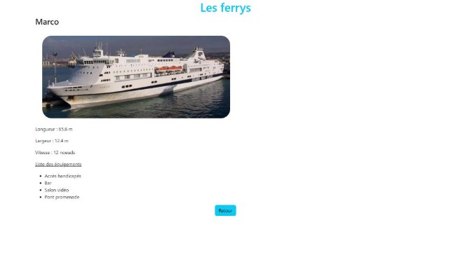
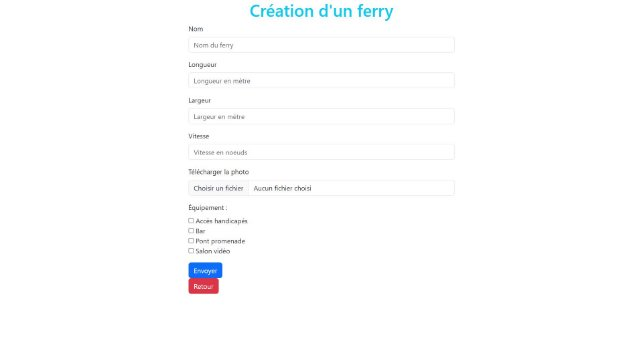
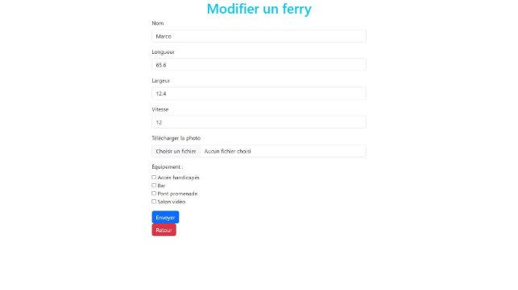
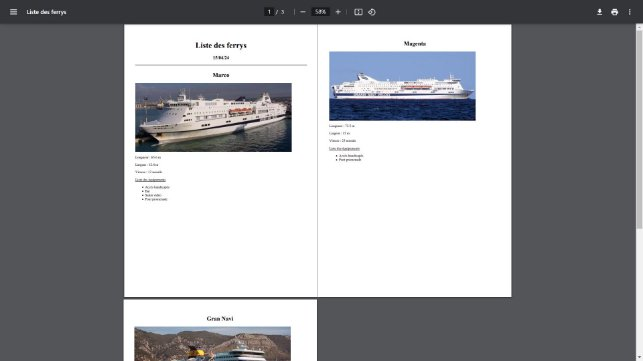
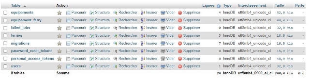

Projet SicilyLines C#
bdd : mlr4

************************

Page de login permettant d’accéder au reste du site

page d’accueil du site, un clique sur voir les bateaux permet d’accéder à une autre page permettant d'interagir avec les différents ferrys.

Page d'interaction avec les ferrys disponible :

- bouton “voir” permettant d’accéder à une page contenant détail des informations d’un ferry
- bouton “modifier” permettant d’accéder à une page pour modifier les informations d’un ferry
- bouton “supprimer” permettant de supprimer un ferry de la bdd
- bouton “ajouter un ferry” permettant d’accéder à une page pour ajouter un ferry
- bouton “générer un pdf” qui télécharge un fichier pdf contenant tous les ferry ainsi que leurs détail présent dans la bdd
- bouton “revenir à l’accueil” pour revenir à la page d’accueil

Page affichant les détail du ferry sélectionné (accessible depuis le bouton “voir” depuis la page d’interaction)

Page de création d’un ferry (accessible depuis le bouton “ajouter un ferry” depuis la page d’interaction)

Page de modification du ferry sélectionné depuis la page contenant les ferry disponible (accessible depuis le bouton “modifier” depuis la page d’interaction)

Exemple de pdf généré lors d’un clique sur le bouton “générer un pdf” depuis la page d’intéraction (contenant tout les détails du ferry : image, nom, dimensions, vitesse, équipements)

Visualisation de la bdd

