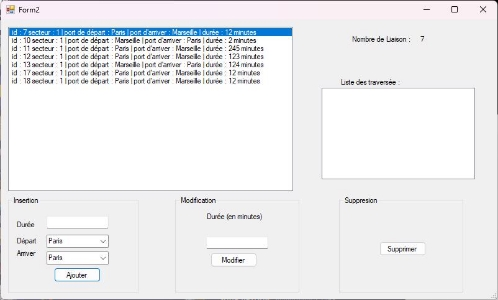

Projet SicilyLines C#
bdd : mlr4

************************

Fenêtre d’accueil de l’application

Fenêtre qui s’affiche suite à un clique sur le bouton liaison. Elle contient les liaisons correspondant au secteur choisi au préalable (permettant l’ajout, la modification et la suppression des différentes liaisons).

Zoom sur la liste des traversée : résultat lorsque l’on sélectionne la liaison avec l’id 10

Fenêtre complète en sélectionnant la liaison avec l’id 10

Zoom sur le menu permettant d'interagir avec les liaisons (ajout d’une liaison en précisant la ville de départ et d'arrivée ainsi que la durée, modification de la durée d’une liaison déjà existante, et suppression d’une liaison)

Visualisation de la BDD sur phpmyadmin

